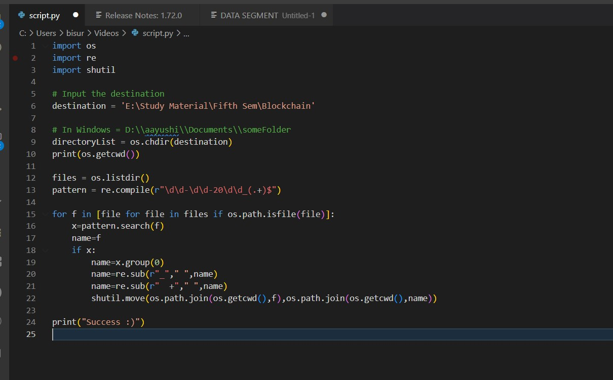
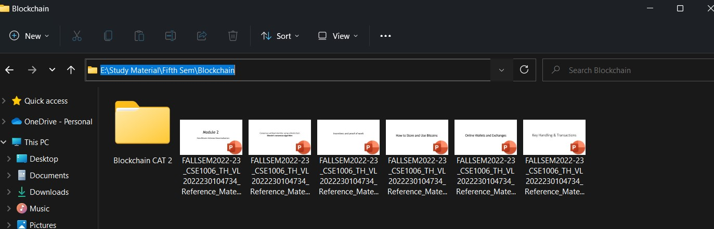
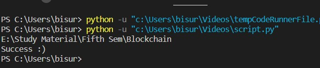
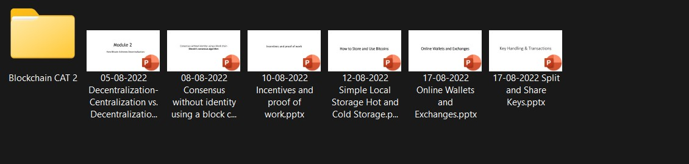

# VTOP FILE RENAME

Having Problem in Finding the topic which you downloaded from Course Page in VTOP.

Get Rid out of the messy names when you Download the course materials from VTOP.

Here is the Solution for that!!

VTOP File Name is a Script based on Python which basically Rename the VTOP downloaded materials to its appropriate names with the date such that its easier for you to find the correct material which you are looking from just by seeing the File names.

## Step 1: Clone the VTOP-File-Rename to your PC

## Step 2: Open the Python Script in any IDE 

## Step 2: Change the destination to Folder where all your VTOP downloaded Files are there.

## Step 3: Execute the Script and all Your File Will be renamed to its appropriate Name

## Authors

- [Dhairya Ostwal](https://www.github.com/dhairyaostwal)

